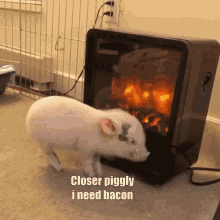
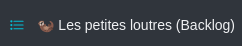
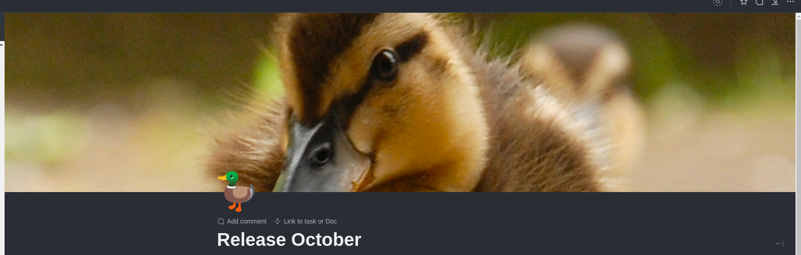
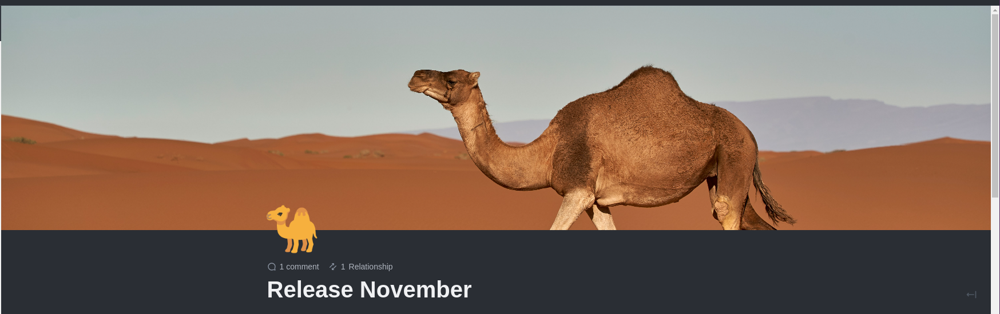
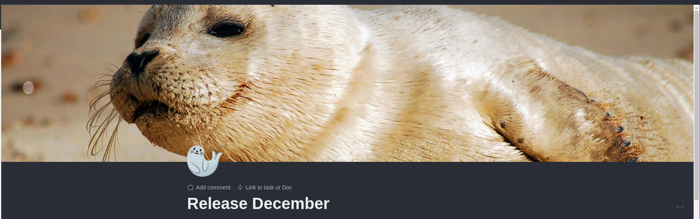
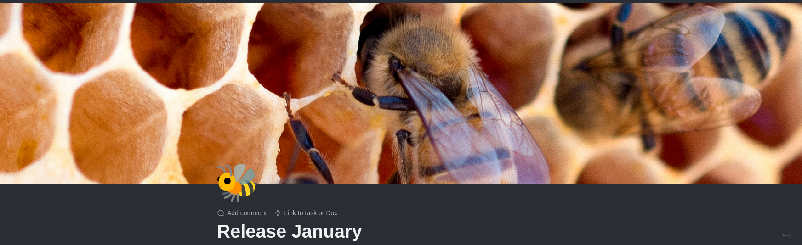
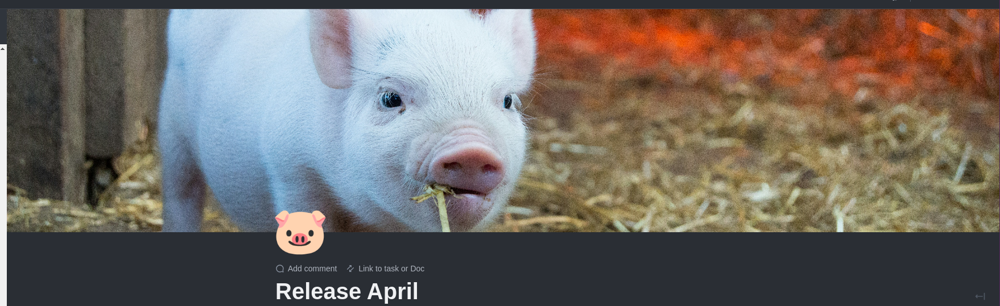
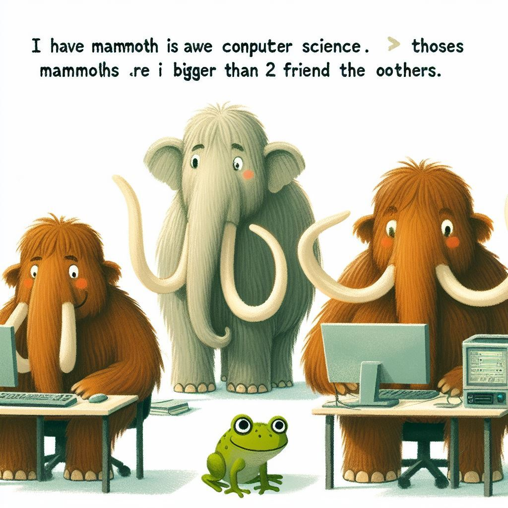

# Let's make ClickUp great again!

---

# Backlog

---

---

## The Chicken

---

## The Pig

---

## Les petites loutres

---

## Les lamentins

---

## Le futur

---

# Release notes?

---

---

---

---

---

---

---

---

---

---

---

# Thanks to the Promark team!

---

