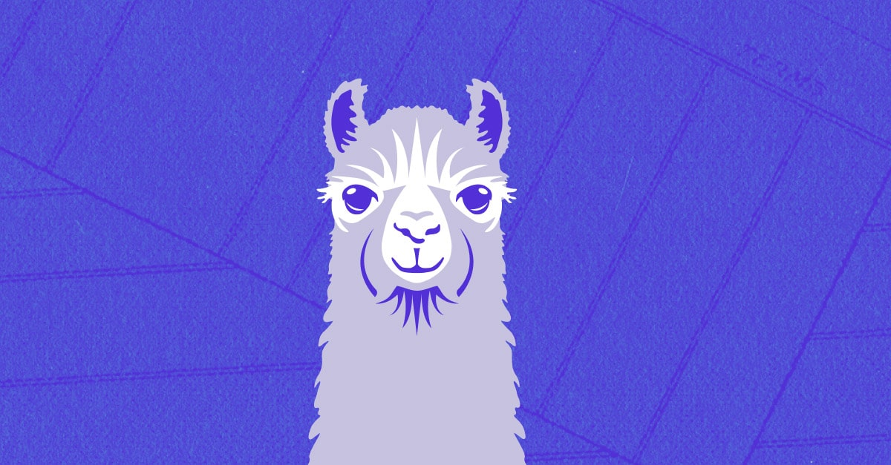

<style>
section::after {
  content: attr(data-marpit-pagination) '/' attr(data-marpit-pagination-total);
}
</style>


# CTF - Let's start hacking

---


---

## Objectives

---

1. What is Cybersecurity?

2. What is a CTF?

3. Poke your curiosity

---

# What is Cybersecurity?

---

> Cybersecurity is the art of protecting networks, devices, and data from unauthorized access or criminal use

[America's cyber defense agency](https://www.cisa.gov/news-events/news/what-cybersecurity)

---

## That's a boring definition

---

> Did you lock door before leaving this morning?

Me

---

Yes?


---

## As developers do we apply the same safety on our code?

---

Data encryption?
Do we salt password?
Is my code safe from race condition?
SQL injection?
Am I using liblzma 5.6.0?
Am I using Sudo-1.8.27?
Buffer overflow?
XSS?
...

# 🎣

---


---

# The best defense is a good offense

---


---

# How do I learn?

---



---


---

# CTF

---

## Capture The Flag (CTF) is ethical hacking

---

# Bug bounty = 💰

# CTF = 🚩

---

## You are allowed to break things in a CTF

### Go find the admin password!

---

# Rules

---

1. Do not cheat, you are not learning that way

2. Don't prevent other people from having fun or preventing our problems from functioning.

3. A flag is a string of text matching this regex: `osedea{[a-zA-Z0-9\_-]*}`

4. Find a flag and get some points 💯

---

# Cryptography

---

`b3NlZGVhe3RoMXMtaTUtczAtMzRzeX0=`

---

`echo "b3NlZGVhe3RoMXMtaTUtczAtMzRzeX0=" | base64 -d`

`osedea{th1s-i5-s0-34sy}`

---

`bfrqrn{gu1f-v5-f0-34fl}`

`6f 73 65 64 65 61 7b 74 68 31 73 2d 69 35 2d 73 30 2d 33 34 73 79 7d`

---

## Cook recipes 

https://gchq.github.io/CyberChef/


---

# Web exploitation

---


---

https://ctf.ageei.org/web1cacas/index.php

---

# Steganography

---


---

`xxd sheep.jpg`

---

`00027d70: 19b7 26f1 3fff d989 504e 470d 0a1a 0a00  ..&.?...PNG.....` 🧐

---

# System

---

`docker exec -it permissions /bin/bash`

---

`Sudo version 1.8.27`

---

# How to learn?

---


https://play.picoctf.org/practice


https://ringzer0ctf.com/

---

# Tools I use

---

bash
binwalk
exiftool
gdb / ghidra
Wireshark
Python / Go

---

# Competitions

---

## [Hackfest](https://hackfest.ca/)

## [Nsec](https://nsec.io/)

## [picoCTF](https://play.picoctf.org/compete)

## [polycyber](https://ctf.polycyber.io/)


---

# Have fun and thank you!

---

# Bonus

---

```nim
import strutils, sequtils

echo "Enter the correct PIN to unlock the door"
var input: string = readLine(stdin)

if input.len != 8 or not all(input, isDigit):
    quit("Invalid input", 1)

let input_numbers: seq[int] = map(input, proc(x: char): int = parseInt($x))

let secret_code: array[8, int] = [2, 9, 3, 8, 5, 9, 1, 4]

for idx, current_number in input_numbers:
    if current_number != secret_code[idx]:
        quit("Invalid PIN", 1)

echo "Access granted!"
```

```bash
$ ./keypad
Enter the correct PIN to unlock the door
123456789
Invalid input
```

---


## 10_000_000 possibilities
## 8 threads
## 3 hours of brute force
