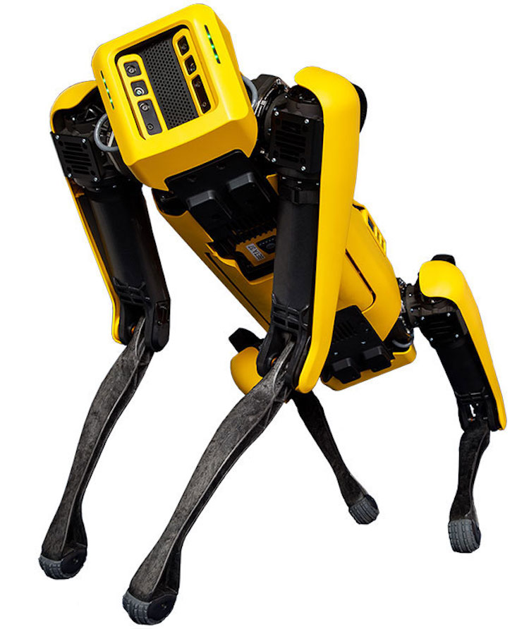
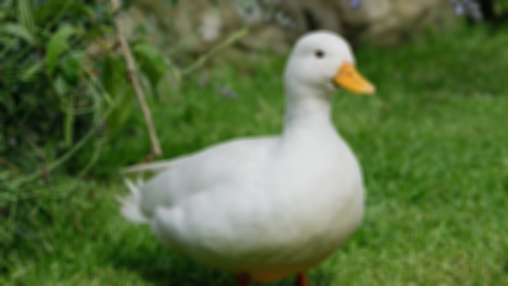
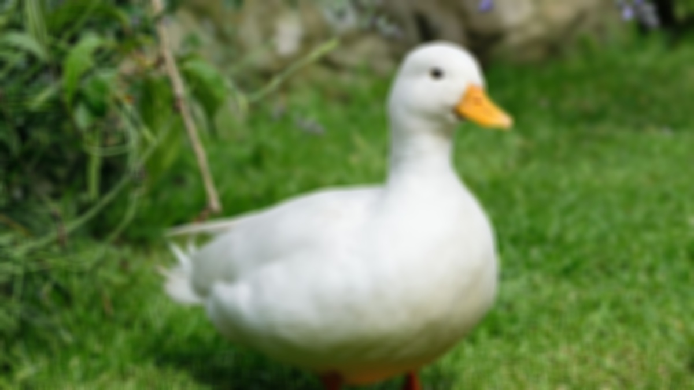
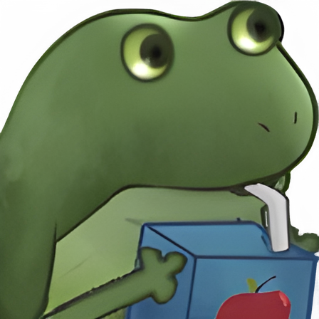
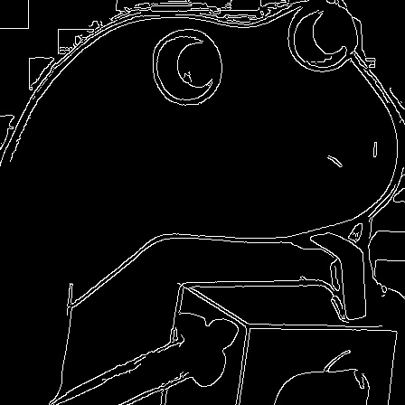
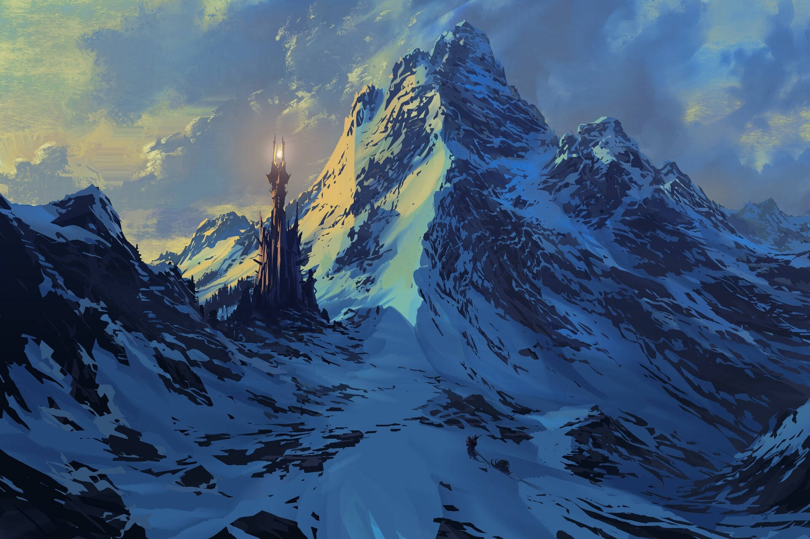
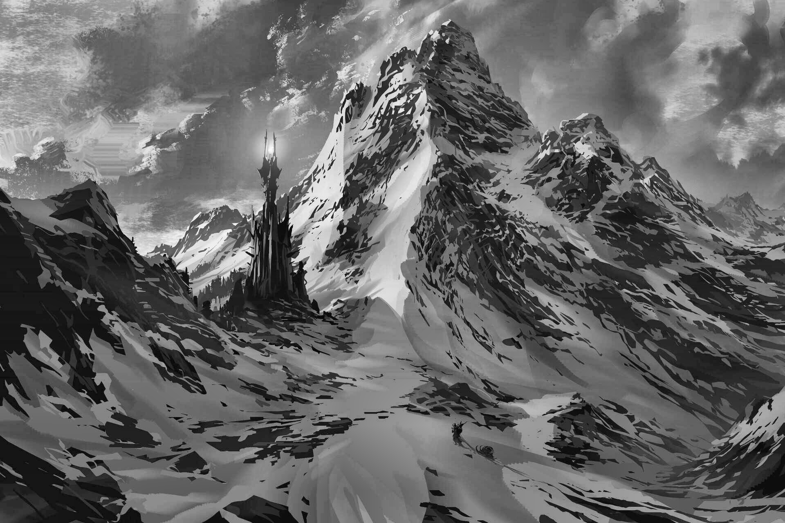
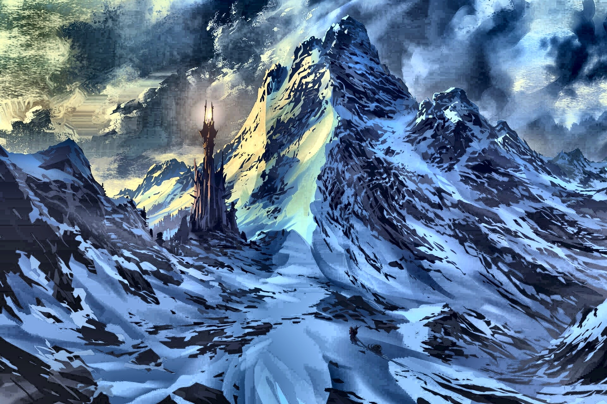
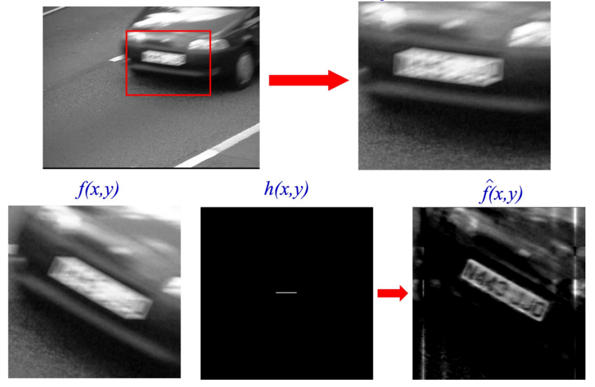

<style>
section::after {
  content: attr(data-marpit-pagination) '/' attr(data-marpit-pagination-total);
}
</style>

# My computer can see

*Alternative titles:*

- My computer can C.. but not really sharp
- I love pixels
- I'm sure I can make a model to detect that

---

# Computer vision?

---

# Some use cases...

---

Identification


---

Afghan Girl - 1984 portrait

 

---

Robotics


---



---

Space


---

# Why computer vision?

---

## We are not perfect


Bill Clinton and Al Gore

---


Same person - From Sinha and Poggio, 1996

---

# What is an image?

---

It's a projection on a film


---


---

Pinhole Camera


---

# Human VS Machine

---

<style scoped>
section {
  transform: rotate(180deg) scale(1);
}
</style>


---


---

# The computer world


---

Lot of numbers


---

# Math

---

Who is my neighbour?

 

---

# OpenCV

---

<!-- _class: invert -->

```bash
# Bash
python3 -m venv env
source env/bin/activate
pip install -r requirements.txt
```

```python
import cv2 as cv
import numpy as np
from matplotlib import pyplot as plt
```

---

Gaussian filter to reduce artifacts


---

<!-- _class: invert -->


```py
# Load duck
img = cv.imread("duck.jpg")

# 2D Convolution - 15x15 filter
kernel = np.ones((15, 15), np.float32) / 250
blur = cv.filter2D(img, -1, kernel)
cv.imwrite("duck-2dconv.jpg", blur)

# Default blur - 15x15 filter
blur = cv.blur(img, (15, 15))
cv.imwrite("duck-blur.jpg", blur)

# Gaussian
blur = cv.GaussianBlur(img, (15, 15), 0)
cv.imwrite("duck-gaussian.jpg", blur)
```

---


---

2D conv

 

---

Blur

 

---

Gaussian

 

---

Edge detection with Canny

<!-- _class: invert -->


```py
# Load froge
img = cv.imread("froge.jpg", cv.IMREAD_GRAYSCALE)

# Canny - img, Threshold1,Threshold2
edges = cv.Canny(img, 50, 200)

cv.imwrite("froge-canny.jpg", edges)
```

---



---



---

Contrast equalization with CLAHE

<!-- _class: invert -->

```py
# Apply CLAHE on grayscale
img = cv.imread("mountain.jpg", cv.IMREAD_GRAYSCALE)
clahe = cv.createCLAHE(clipLimit=2.0, tileGridSize=(8, 8))
cl1 = clahe.apply(img)

cv.imwrite("mountain-clahe-grayscale.jpg", cl1)


# Apply CLAHE on color
img = cv.imread("mountain.jpg", cv.IMREAD_ANYCOLOR)
img = cv.cvtColor(img, cv.COLOR_RGB2Lab)

clahe = cv.createCLAHE(clipLimit=10, tileGridSize=(8, 8))
img[:, :, 0] = clahe.apply(img[:, :, 0])
img = cv.cvtColor(img, cv.COLOR_Lab2RGB)

cv.imwrite("mountain-clahe-rgb.jpg", img)
```

---



---

 

---

 

---

Panoramic picture


---

# Unblur an image

---
Spectral analysis - Wiener filter



---

# No AI today...
# maybe next time?

---

# Sources


Joël Lefebvre
https://professeurs.uqam.ca/professeur/lefebvre.joel/

---

- Afghan girl was Identified https://www.cl.cam.ac.uk/~jgd1000/afghan.html
- Spot https://bostondynamics.com/products/spot/
- Space CLAHE https://siril.readthedocs.io/zh-cn/latest/processing/clahe.html

- Bill Clinton and Al Gore https://www.researchgate.net/figure/Although-this-image-appears-to-be-a-fairly-run-of-the-mill-picture-of-Bill-Clinton-and-Al_fig6_228796924

---

- Pinhole camera https://en.wikipedia.org/wiki/Pinhole_camera
- Canny https://en.wikipedia.org/wiki/Edge_detection
- Clahe https://www.analyticsvidhya.com/blog/2022/08/image-contrast-enhancement-using-clahe/

---

# Questions?

---


