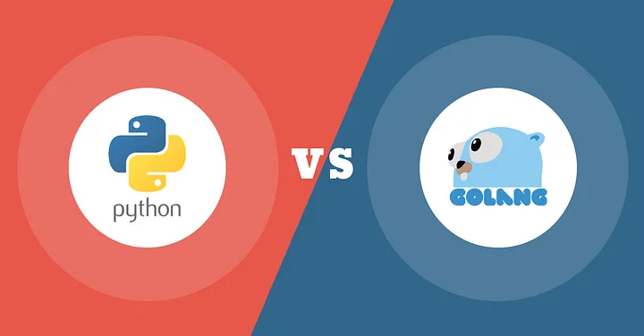
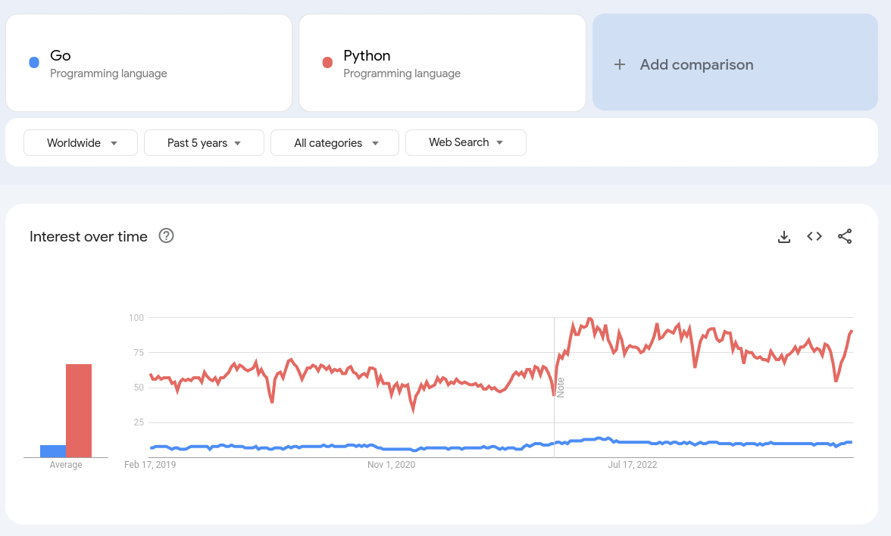
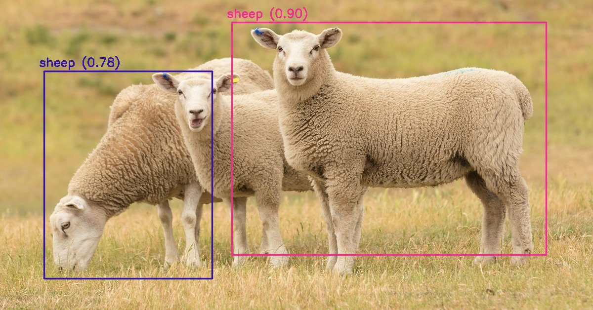
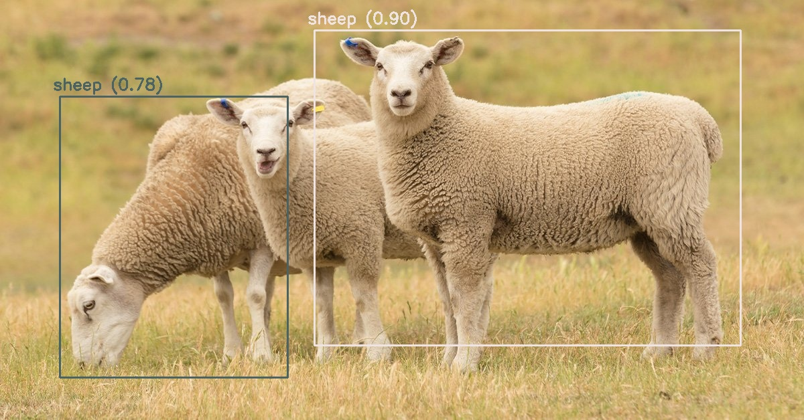
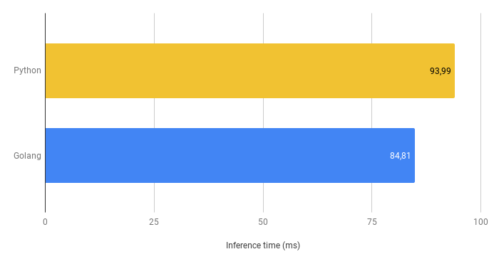

# Golang VS Python

---

# Serve an AI model for object detection with OpenCV

---

1. Objective of the presentation
2. Any requirements?
3. Tools we are going to use
4. What is Python
5. What is Golang
6. What is OpenCV
7. What is Yolo
8. Onnx format
9. Code
10. Demo

---

# Objective of the presentation

---

---

# Let's dive in

---

---

---

# Results

---

---

Average inference time in Python: 93.99 ms

---

---

Average inference time in Golang: 84.81 ms

---

---

~10.8 % increase

---

# Src

---

- Background image source https://medium.com/swlh/python-vs-golang-select-the-best-one-to-level-up-your-business-1a6d0fb32991
- OpenCV https://opencv.org/
- GoCV https://gocv.io/
- OpenCV-Python https://github.com/opencv/opencv-python
- Google trends https://trends.google.com/trends/explore?date=today%205-y&q=%2Fm%2F09gbxjr,%2Fm%2F05z1_
- Uber using Golang https://www.uber.com/en-CA/blog/go-geofence-highest-query-per-second-service/
- Twitch using Golang https://medium.com/twitch-news/gos-march-to-low-latency-gc-a6fa96f06eb7
- Netflix high performance proxy in go https://netflixtechblog.com/application-data-caching-using-ssds-5bf25df851ef